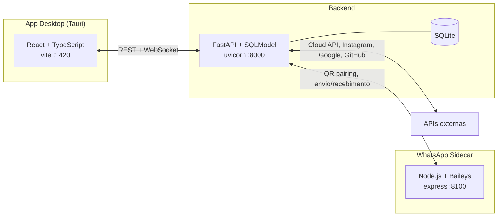

<div align="center">

# ∞ DailyLoop

### Sistema operacional pessoal e de negócios, com IA embutida.

Tarefas, finanças, CRM omnichannel (WhatsApp/Instagram/Email) e um assistente de IA que
responde por você — tudo num só app desktop.

[](#-stack)
[](#-stack)
[](#-stack)
[](#)

</div>

---

## ✨ O que é

**DailyLoop** ("Prometheus") é um app desktop multiusuário que junta, num só lugar:

- 📋 **Produtividade** — tarefas, notas, metas, rituais, calendário.
- 💰 **Finanças** — transações, orçamentos por categoria, import de extrato (CSV/OFX) com
  categorização automática.
- 📥 **Inbox/CRM omnichannel** — WhatsApp (Cloud API oficial *ou* QR Code), Instagram DM,
  Facebook Messenger e Email, tudo caindo na mesma caixa de entrada, com IA respondendo
  automaticamente quando ligada.
- 🧠 **Prometheus** — assistente de IA (Gemini) com acesso de leitura/escrita às suas
  tarefas e finanças via function calling.
- 🔗 **Integrações** — Google (Calendar/Gmail/Fit), GitHub, WhatsApp Pessoal (chat completo
  estilo WhatsApp Web), e mais.

Dois "mundos" convivem no mesmo app: o **Pessoal** (você) e o **Empresarial** (seu
negócio) — cada um com suas próprias integrações e dados, sem se misturar.

## 🧭 Arquitetura

Três processos independentes, que só se falam por HTTP/WebSocket em `localhost`:



| Processo | Onde vive | Pra que serve |
|---|---|---|
| **Frontend** | `src/`, `src-tauri/` | Interface (Tauri desktop + React), fala com o backend via `src/lib/api.ts` |
| **Backend** | `backend/` | API REST, banco (SQLite via SQLModel), IA, agendador (APScheduler), integrações |
| **WhatsApp Sidecar** | `whatsapp-sidecar/` | Pareamento via QR Code (Baileys) — não existe SDK Python oficial pra esse protocolo |

## 🚀 Como rodar localmente

### Pré-requisitos

- **Node.js** 18+ e **npm**
- **Python** 3.11+
- **Rust** (só se for rodar o shell desktop Tauri — `npm run tauri dev`; pra
  desenvolver só a interface web, `npm run dev` sozinho já basta)

### 1. Clonar e configurar variáveis de ambiente

```bash
git clone https://github.com/YuriGabriel1602/DailyLoop.git
cd DailyLoop
cp .env.example .env
```

Abra o `.env` e preencha pelo menos:

- `GEMINI_API_KEY` — [aistudio.google.com/app/apikey](https://aistudio.google.com/app/apikey)
- `JWT_SECRET_KEY` — gere com `python -c "import secrets; print(secrets.token_hex(32))"`
- `CREDENTIAL_ENCRYPTION_KEY` — gere com `python -c "from cryptography.fernet import Fernet; print(Fernet.generate_key().decode())"`

O resto (SMTP, WhatsApp, Instagram, Google, GitHub) é opcional — sem preencher, cada
integração é pulada silenciosamente em vez de quebrar o app. Veja os comentários no
próprio `.env.example` pra cada uma.

### 2. Backend

```bash
cd backend
python -m venv venv
venv\Scripts\activate          # Windows
# source venv/bin/activate     # Linux/macOS
pip install -r requirements.txt
python main.py
```

Sobe em `http://127.0.0.1:8000`. Na primeira vez, cria o banco SQLite
(`dailyloop_brain.db`) e roda as migrações automaticamente.

### 3. Frontend

Em outro terminal, na raiz do projeto:

```bash
npm install
npm run tauri dev     # app desktop completo
# ou, só a interface web:
npm run dev
```

Abre em `http://127.0.0.1:1420` — espera o backend já estar de pé.

### 4. WhatsApp Sidecar (opcional)

Só necessário se for usar WhatsApp via QR Code (Pessoal ou Business). Em outro terminal:

```bash
cd whatsapp-sidecar
cp .env.example .env    # SIDECAR_SHARED_SECRET tem que ser IGUAL ao do .env da raiz
npm install
node src/index.js
```

Sobe em `http://127.0.0.1:8100`.

### Primeiro acesso

O primeiro usuário criado em `/register` vira automaticamente **admin**.

## 📁 Estrutura do projeto

```
DailyLoop/
├── src/                    # Frontend React (páginas, componentes, lib de API/WebSocket)
├── src-tauri/               # Shell desktop Tauri (Rust)
├── backend/
│   ├── routers/              # Um arquivo por domínio (tasks, finance, inbox, instagram_auth...)
│   ├── services/              # Regra de negócio (IA, email, WhatsApp, criptografia...)
│   └── database.py            # Modelos SQLModel
└── whatsapp-sidecar/         # Pareamento WhatsApp via QR Code (Baileys)
```

## 🛠️ Stack

**Frontend** — React 19 · TypeScript · Vite · Tauri 2 · Tailwind · shadcn/ui · Zustand
**Backend** — FastAPI · SQLModel (SQLite) · APScheduler · google-genai (Gemini)
**Sidecar** — Node.js · Express · @whiskeysockets/baileys

---

<div align="center">
<sub>Feito com ∞ por Yuri Gabriel</sub>
</div>
